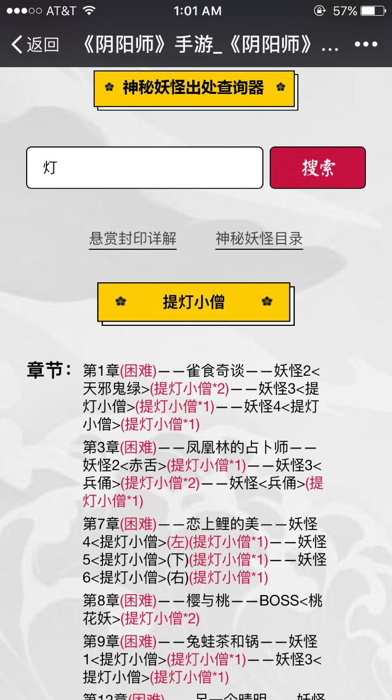
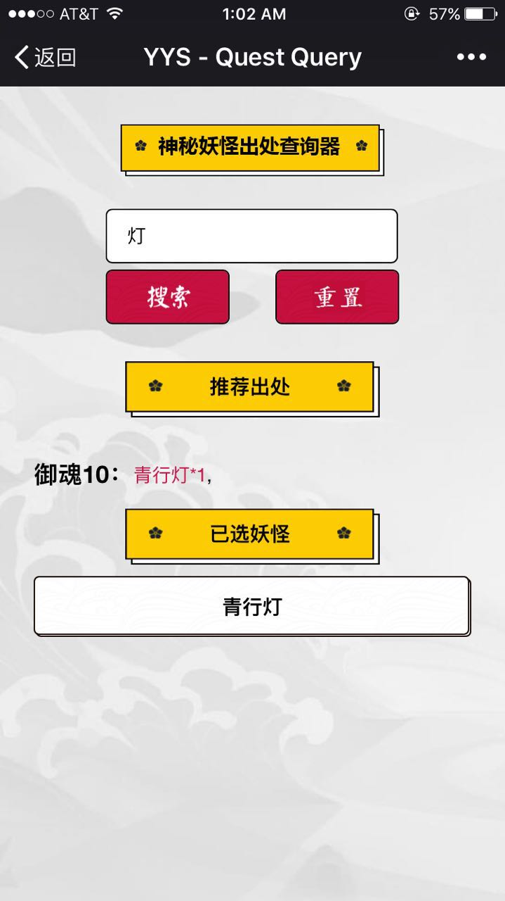
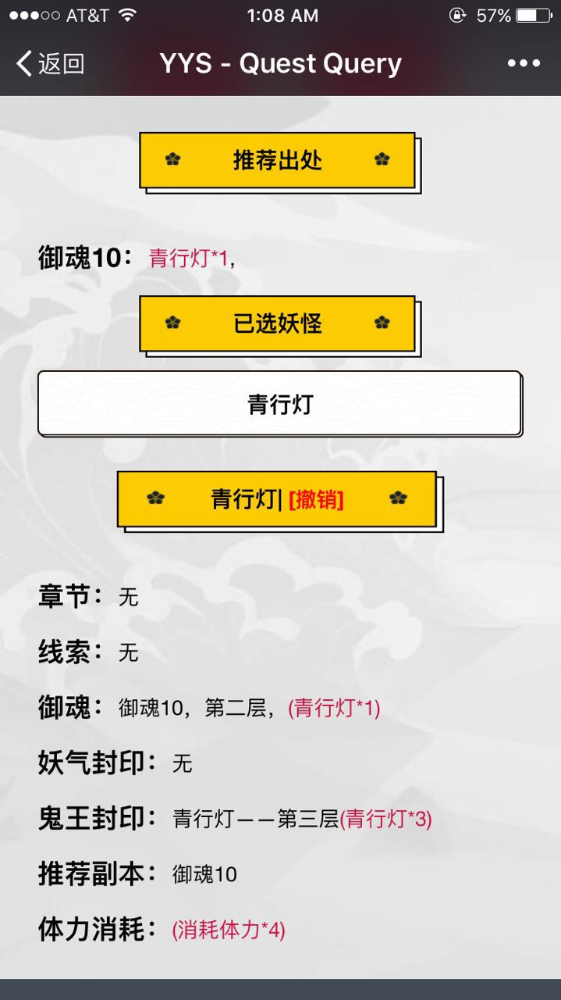
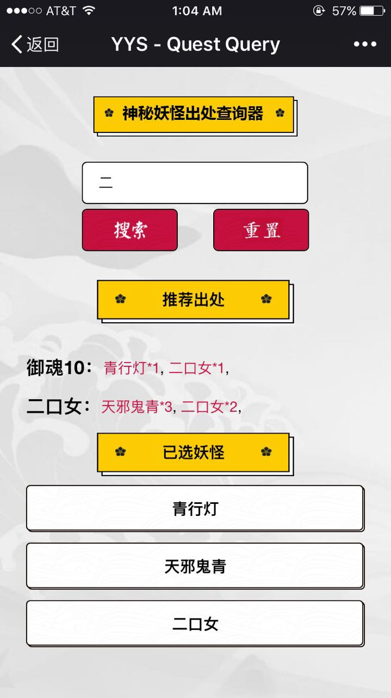
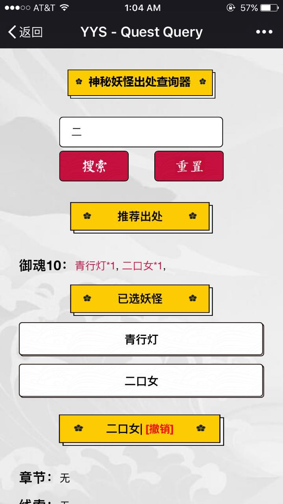

# yysWebQuery
A website designed for mobile devices to query the quests in mobile game Ying Yang Shi.

[DEMO](https://youtu.be/-lUkhZABgfk) (the recording software doesn't highlight touching spot, so the demo might be a bit confusing)

## [The query page from offical site](http://yys.163.com/m/fengyin/)
* can only hold one target for query
* simply shows the related detail about the target

## [The query from this project](https://ghlgh.github.io/yysWebQuery/)
* can hold multiple targets for query (up to four targets because player can have up to four quests at the same time)
* **will show locations in game that player can encounter the most targets at once**
* keep the functionality of checking each target's detail
* **user can remove one or all selected targets in case of selecting wrong target**

   
